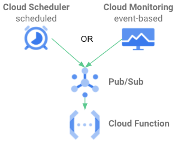

# GCP-CVS-CapacityManager


A script to resize [Cloud Volumes Service (CVS)](https://cloud.google.com/architecture/partners/netapp-cloud-volumes/overview?hl=en_US) volumes on GCP to avoid running into out-of-space conditions.

## Concept
There are three ways to run the script:

### CLI or schedules via Cloud Scheduler

Whenever the script runs, it enumerates all volumes in the specified project. For each volume, it determines the used size (numbers of bytes consumed by data) and the quota (size of the volume as set by user).

The user  needs to specify the *interval* the script is invoked and an optional security *margin*.

Since the service level and the size of a volume determine maximum write speed, the script can calculate the maximum amount of new data which can be written to the volume within the interval (e.g every 60 minutes). This results in a new potential size. A security margin (in %) can be added (e.g. 10 for 10%) on top. If the new potential size is bigger than the current quota, the volume quota will be grown to the calculated size.

If the script is executed at the same scheduling interval specified in *duration*, the volume will always be big enough to avoid out-of-space conditions.

It can be run in a traditional way, scheduled via cronjob on a VM, or in a complete serverless way.

On GCP, the recommended approach is to use Google Cloud Scheduler to trigger Pub/Sub messages, which are received by the script running as Cloud Function.



### Event driven via Cloud Monitoring alerts

CVS documentation recommends to implement [Monitoring of cloud volumes](https://cloud.google.com/architecture/partners/netapp-cloud-volumes/monitoring?hl=en_US). Users can setup an alert policy to monitor volume free space. If usage ratio goes over a threshold, Cloud Monitoring will trigger an incident. Incidents can be sent to multiple notification channels. Using PubSub as notification channel, incidents (events) can be sent to this script running as Cloud Function.

Running in this special mode, only the volume sent by PubSub event will be resized. New size will newSize = current_allocated_size * 100 / (100 - margin).


[cvs-Alerting-PubSub.tf](Alerting/cvs-Alerting-PubSub.tf) contains a Terraform example for an alert policy.

## Usage

The script can be invoked via CLI or via a PubSub message. Independent of invocation type, 4 arguments are needed as input:

* **projectid**: GCP project ID (e.g my-project) or GCP project number (e.g. 1234567890). If project ID is specified, the script needs *resourcemanager.projects.get* permissions. Otherwise use project number
* **duration**: Time interval in minutes the script will be called (e.g. 60 for every 60 minutes)
* **margin**: In triggered mode, it specifies additional security margin in % which will be added on top of the calculated size. For event based invocation, newSize = current_allocated_size * 100 / (100 - margin)
* **service_account**: A base64 encoded JSON key for an [IAM service account](https://cloud.google.com/architecture/partners/netapp-cloud-volumes/api?hl=en_US) which has *roles/netappcloudvolumes.admin*. Use ```cat key.json | base64``` to generate it. Goal is to eventually use service account impersonation, but we need to stick with passing credentials for now
* **dry_mode**: If present, script will only report intended actions, but will not change volume sizes

For Cloud Monitoring alert event based invocation, projectid will be provided by the PubSub event and doesn't need to be specified.

### CLI
The script takes the 5 arguments via environment variables. Example:

```bash
# Make sure python3.6 or later environment exists on your machine
git clone https://github.com/NetApp-on-Google-Cloud/GCP-CVS-CapacityManager.git
cd GCP-CVS-CapacityManager
pip3 install -r requirements.txt
export DEVSHELL_PROJECT_ID=$(gcloud config get-value project)
export CVS_CAPACITY_INTERVAL=60 # default is 60 minutes
export CVS_CAPACITY_MARGIN=20 # default is 20% on top
export SERVICE_ACCOUNT_CREDENTIAL=$(cat key.json | base64)
export CVS_DRY_MODE="whatever" # To allow changes "unset CVS_DRY_MODE"
python3 ./main.py
```

### PubSub message triggered

The script contains a PubSub subscriber function *CVSCapacityManager_pubsub* for tiggered execution, e.g. via Cloud Scheduler

Parameters are passed via environment variables to the Cloud Function.

The intended way to run it is using [Google Cloud Scheduler](https://cloud.google.com/scheduler) to trigger [Google PubSub messages](https://cloud.google.com/pubsub), which are received by the script running as [Google Cloud Function](https://cloud.google.com/functions). Example:

```bash
git clone https://github.com/NetApp-on-Google-Cloud/GCP-CVS-CapacityManager.git
cd GCP-CVS-CapacityManager

# Create new PubSub topic
topic=CVSCapacityManager
gcloud pubsub topics create $topic

# Set serviceAccount to name of service account with cloudvolumes.admin permissions (see https://cloud.google.com/architecture/partners/netapp-cloud-volumes/api?hl=en_US). This can later be used for service account impersonation, but is currently defunct.
# Provide JSON key to this service account in a file named key.json
serviceAccount=$(cat key.json | jq -r '.client_email')
# serviceAccount="cloudvolumes-admin-sa@my-project.iam.gserviceaccount.com"

# Deploy Cloud Function
# add "CVS_DRY_MODE: x" to enable dry mode, omit CVS_DRY_MODE to active volume resizing
cat <<EOF > .temp.yaml
DEVSHELL_PROJECT_ID: $(gcloud config get-value project)
CVS_CAPACITY_MARGIN: "20"
CVS_CAPACITY_INTERVAL: "60"
SERVICE_ACCOUNT_CREDENTIAL: $(cat key.json | base64)
EOF
gcloud functions deploy CVSCapacityManager --entry-point CVSCapacityManager_pubsub --trigger-topic $topic --runtime=python39 --region=europe-west1 --service-account $serviceAccount --env-vars-file .temp.yaml
rm .temp.yaml

# Setup Cloud Scheduler
# run every hour (60 minutes)
gcloud scheduler jobs create pubsub CVSCapacityManager-job --schedule="0 * * * *" --time-zone="Etc/UTC" --topic=$topic
```

### Cloud Monitoring alert triggered

The script contains a PubSub subscriber function *CVSCapacityManager_alert_event* which is intended to be triggered by a Cloud Monitoring alert.

Parameters are passed via environment variables to the Cloud Function.

The intended way to run it is use a alert as described in [Monitoring cloud volumes](https://cloud.google.com/architecture/partners/netapp-cloud-volumes/monitoring?hl=en_US). Configure PubSub as notification channel and attach this script running as [Google Cloud Function](https://cloud.google.com/functions) to the PubSub topic.

Warning:
* The Cloud Function is only triggered once, if threshold is breached. Make sure your margin adds enough space to get the volume under the threshold (e.g. 20% margin for a 80% threshold), otherwise volume stays above threshold and resizing will not be triggered again. Sizind advice: margin >= 100-threshold. e.g for a threshold at 80%, margin should be set >= 20%
* Events created before the Cloud Function did subscribe to the PubSub topic are lost. You need to resize the volumes in advance, e.g. by using the CLI way

Example screenshot of event-based invocation in action:


Please note:
Cloud Monitoring metrics are pushed every 300 seconds. It can take up to 5 minutes for an incident to be triggered. After incident was triggered and reszingin of volume happened, it takes another 5 minutes for these changes to be reflected in Cloud Monitoring.


Set-up Example:
```bash
git clone https://github.com/NetApp-on-Google-Cloud/GCP-CVS-CapacityManager.git
cd GCP-CVS-CapacityManager

# Make sure to setup Cloud Monitoring alert policy. Send incidents to a PubSub notification channel.
# Make sure Cloud Monitoring service account is allowed to send messages to PubSub
# See https://cloud.google.com/monitoring/support/notification-options#pubsub
# it is recommended to use the supplied Terrafrom template
# to setup Cloud MOnitoring Alert, PubSub Topic, permissions and Notification Channel
cd Alerting
terraform init
terraform apply
cd ..

topic=CVSCapacityManagerEvents

# Set serviceAccount to name of service account with cloudvolumes.admin permissions (see https://cloud.google.com/architecture/partners/netapp-cloud-volumes/api?hl=en_US). This can later be used for service account impersonation, but is currently defunct.
# Provide JSON key to this service account in a file named key.json
serviceAccount=$(cat key.json | jq -r '.client_email')
# or set manually: serviceAccount="cloudvolumes-admin-sa@my-project.iam.gserviceaccount.com"

# Deploy Cloud Function
# add "CVS_DRY_MODE: x" to enable dry mode, omit CVS_DRY_MODE to active volume resizing
cat <<EOF > .temp-event.yaml
CVS_CAPACITY_MARGIN: "20"
SERVICE_ACCOUNT_CREDENTIAL: $(cat key.json | base64)
EOF
gcloud functions deploy CVSCapacityEventManager --entry-point CVSCapacityManager_alert_event --trigger-topic $topic --runtime=python39 --region=europe-west1 --service-account $serviceAccount --env-vars-file .temp-event.yaml
rm .temp-event.yaml
```

## Notes
* Setting up Cloud Monitoring for volume space usage is recommended. See [Monitoring cloud volumes](https://cloud.google.com/architecture/partners/netapp-cloud-volumes/monitoring?hl=en_US)
* The script uses [NetApp Cloud Volumes Service API](https://cloud.google.com/architecture/partners/netapp-cloud-volumes/api?hl=en_US) to query volume data and set new volume size
* Only volumes with *lifeCycleState = available* are considered, all others are ignored
* Secondary volumes in an *active* CRR relationship are ignored. Resize primary volume to automatically resize secondary volume
* Snapshot space handling: The script uses the usedBytes API parameter. It includes all active data, metadata and snapshot blocks
* SnapReserve handling: *snapReserve* only impacts the amount of space presented to the client via df/statvfs (e.g 2000 GiB volume, snapReserve 20%, client only sees 1600 GiB). The script uses *usedBytes*, which isn't influenced by *snapReserve*
* If target volume size is larger than [maximum volume size](https://cloud.google.com/architecture/partners/netapp-cloud-volumes/resource-limits-quotas?hl=en_US), new volume size will be set to 100 TiB
* For host/service projects, run the script in each service/host project with provisioned volumes
* Script is developed and tested with Python 3.9 on MacOS and Linux

## Troubleshooting
If you run into issues, try running the script the CLI way first, as it removes the complexity of Cloud Schedule, PubSub and CloudFunctions. Does it work? Are your parameters correct?

Setting 
```bash
export CVS_DEBUGGING=true
```
will output more information.

Also consider running in dry-mode:
```bash
export CVS_DRY_MODE=true
```

If CLI works, but CloudFunction doesn't, check the the logs of the cloud function. The script will log parameters on invocation. Verify if they reflect you intentions.

Are you seeing python exceptions? Most of them will return HTTP error codes which indicate infrastructure issues, usually network connection or authentication issues.

## Support
This tool is not supported by NetApp or Google and provided as-is. Run at your own risk.

### Risk assessment

It only does read operations, except when growing a volume. To grow a volume, it queries a volume, changes the *quotaInBytes* parameter and does an PUT API call, which is the equivalent of changing the size in the UI. The PUT call can be disabled by enabling dry-mode.

*Note:* Larger volumes incur more monthly costs.

### Getting help
If you have any issues, please check logs first.

Most likely issue is authentication issues, which will result in HTTP errors (sometimes hidden in multiple lines of python exception output). Make sure the credentials are correctly passed.

When ran as Cloud Function, it will log a line for each volume to Cloud Logging. Any indication why it fails? Make sure to pass the parameters correctly.

Next, check the issue section of this repository to see if it is a known issue.

If you still found no resolution, please consider opening an GitHub issue for this repository. Support is best-effort.
